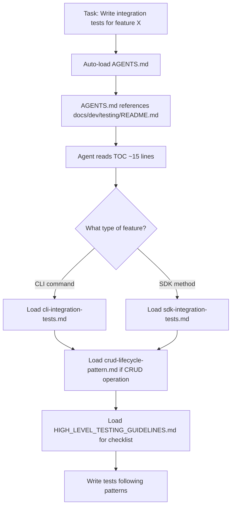
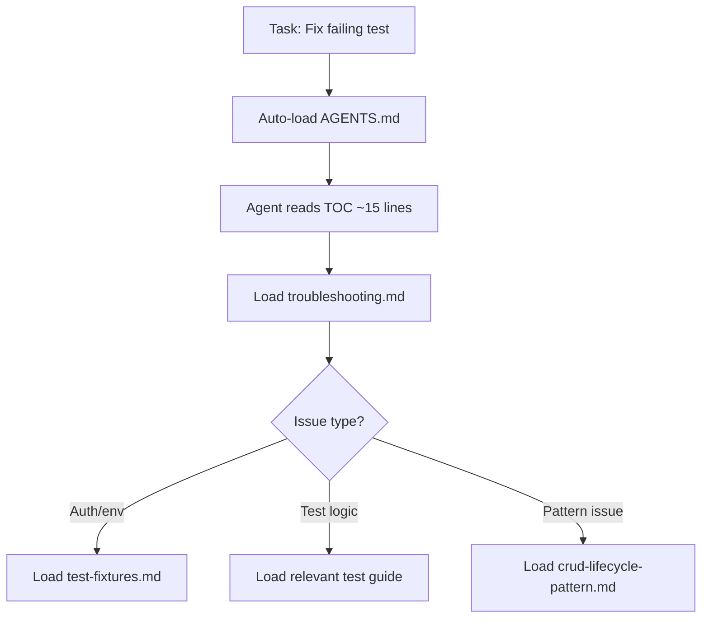
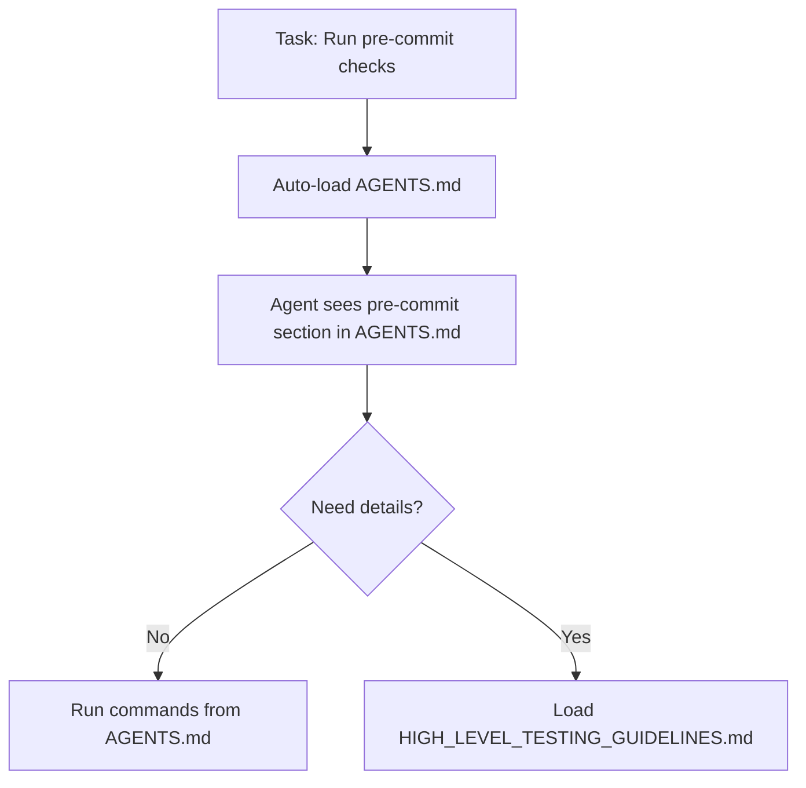
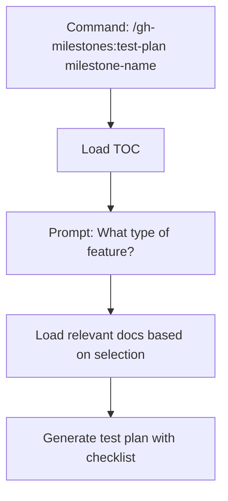

# AI Agent DX Design for Progressive Disclosure Testing Documentation

**Issue:** #558 (556.2-design Design AI agent DX for progressive disclosure testing docs)
**Parent:** #556 (ls-test-improvement milestone)
**Date:** 2025-12-05
**Author:** Claude Code

---

## Executive Summary

### Design Goals

1. **Minimize context window pollution** - AI agents should only load testing documentation when actually needed
2. **Enable on-demand discovery** - Agents can find relevant docs through clear naming and TOC
3. **Prevent #536-type bugs** - Documentation patterns ensure tests verify actual behavior, not just exit codes
4. **Reduce maintenance burden** - Consolidate DRY violations into single sources of truth
5. **Support progressive disclosure** - Layer information from high-level principles to implementation details

### Design Principles

| Principle | Rationale |
|-----------|-----------|
| **TOC-first navigation** | Agents read TOC (~15 lines) to identify relevant docs, not all 3,667 lines |
| **Clear file naming** | Names like `crud-lifecycle-pattern.md` are grep-able and self-descriptive |
| **Size limits** | Each doc <500 lines ensures focused, loadable content |
| **AGENTS.md integration** | Single reference point that auto-loads on every task |
| **DRY consolidation** | One source of truth for each concept reduces drift |

### Projected Impact

| Metric | Before | After | Improvement |
|--------|--------|-------|-------------|
| Lines loaded for typical task | ~1,500 | ~300 | 80% reduction |
| Token usage for test writing | ~11,000 | ~3,600 | ~67% reduction |
| DRY violations | 4 major | 0 | Eliminated |
| #536-type bug prevention | None | CRUD pattern | +1 safeguard |

---

## 1. Progressive Disclosure Architecture

### File Structure

```
docs/dev/testing/
├── README.md                           # TOC only (~15 lines)
├── HIGH_LEVEL_TESTING_GUIDELINES.md    # Principles (<200 lines)
├── crud-lifecycle-pattern.md           # Pattern with examples (<300 lines)
├── sdk-integration-tests.md            # SDK-specific guidance (<250 lines)
├── cli-integration-tests.md            # CLI-specific guidance (<200 lines)
├── devcontainer-feature-tests.md       # DevContainer testing reference (<50 lines)
├── test-fixtures.md                    # Deployment patterns, env vars (<150 lines)
├── mocking-patterns.md                 # httpmock guidance (<150 lines)
├── troubleshooting.md                  # Consolidated troubleshooting (<200 lines)
└── post-mortems/
    └── 536-prompt-list-testing-gap.md  # Case study (<200 lines)
```

**Total: ~10 files, ~1,700 lines** (down from ~3,667 lines scattered across 10 locations)

### File Design Rationale

#### README.md (~15 lines)

**Purpose:** Minimal TOC that agents auto-load via AGENTS.md reference

**Design constraints:**
- MUST be ≤15 lines (excluding blank lines and table formatting)
- MUST list all files with one-line descriptions
- MUST NOT contain substantive content (only links)

**Example content:**
```markdown
# Testing Documentation

| Doc | Purpose |
|-----|---------|
| [HIGH_LEVEL_TESTING_GUIDELINES.md](./HIGH_LEVEL_TESTING_GUIDELINES.md) | Core principles, Toyota andon cord, test design checklist |
| [crud-lifecycle-pattern.md](./crud-lifecycle-pattern.md) | CLI→SDK verification pattern that prevents #536-type bugs |
| [sdk-integration-tests.md](./sdk-integration-tests.md) | SDK test patterns, deployment guards, naming conventions |
| [cli-integration-tests.md](./cli-integration-tests.md) | CLI test patterns, fixtures, serialization |
| [test-fixtures.md](./test-fixtures.md) | Test deployment setup, environment variables |
| [mocking-patterns.md](./mocking-patterns.md) | When and how to use httpmock |
| [troubleshooting.md](./troubleshooting.md) | Common failures and debugging steps |
| [post-mortems/](./post-mortems/) | Bug case studies and lessons learned |
```

#### HIGH_LEVEL_TESTING_GUIDELINES.md (<200 lines)

**Purpose:** Universal principles that apply to ALL tests

**Content requirements:**
- Toyota andon cord principle (never bypass failing tests)
- Test design review checklist
- Exit code vs output verification (anti-pattern)
- Unit vs integration test selection criteria
- Pre-commit checklist (consolidated from 3 locations)

**Load trigger:** First time agent designs ANY test

#### crud-lifecycle-pattern.md (<300 lines)

**Purpose:** The pattern that would have prevented #536

**Content requirements:**
- CRUD verification workflow (Create→Verify→Read→Verify→Update→Verify→Delete→Verify)
- Code examples for both good and bad patterns
- Integration with CLI→SDK verification
- Checklist for CRUD test completeness

**Load trigger:** Writing integration tests for CLI commands that modify resources

#### sdk-integration-tests.md (<250 lines)

**Purpose:** SDK-specific testing patterns

**Content requirements:**
- Deployment vs Revision status concepts
- TestDeploymentConfig patterns
- DeploymentGuard RAII cleanup
- Test naming conventions for SDK

**Load trigger:** Writing SDK integration tests

#### cli-integration-tests.md (<200 lines)

**Purpose:** CLI-specific testing patterns

**Content requirements:**
- TestDeployment fixture pattern
- serial_test usage for resource contention
- Output parsing and verification
- Test organization by command

**Load trigger:** Writing CLI integration tests

#### test-fixtures.md (<150 lines)

**Purpose:** Consolidated environment and deployment setup

**Content requirements:**
- All required environment variables (consolidate from 4 locations)
- Test deployment naming patterns (PR/Dev vs Release)
- Test graph deployment reference
- CI vs local test running

**Load trigger:** Setting up test environment or debugging auth issues

#### mocking-patterns.md (<150 lines)

**Purpose:** Guidance on when and how to mock

**Content requirements:**
- When to use httpmock vs real API
- Mock server setup patterns
- Test isolation with mocks
- Performance testing with mocks

**Load trigger:** Deciding whether to mock external services

#### troubleshooting.md (<200 lines)

**Purpose:** Consolidated debugging guide

**Content requirements:**
- Common failure patterns and solutions
- Auth and environment issues
- CI vs local differences
- Log interpretation

**Load trigger:** Debugging failing tests

### Size Limit Enforcement

Each file includes a header comment enforcing its specific size limit (as defined in the File Structure section above):

```markdown
<!--
  SIZE LIMIT: This file MUST remain under [X] lines.
  (Replace [X] with file-specific limit: 200 for HIGH_LEVEL_TESTING_GUIDELINES.md,
   300 for crud-lifecycle-pattern.md, etc. - see File Structure above)
  Current: ~[Y] lines | Last checked: [DATE]
  If approaching limit, extract content to sub-document.
-->
```

---

## 2. Agent Reading Workflow Design

### Workflow 1: Writing New Integration Tests



**Token usage:**
- TOC: ~100 tokens
- Relevant guide: ~1,500 tokens
- CRUD pattern: ~2,000 tokens
- Guidelines: ~1,500 tokens
- **Total: ~5,100 tokens** (vs ~10,050 for typical task; see Section 6 for analysis)

### Workflow 2: Debugging Failing Tests



**Token usage:**
- TOC: ~100 tokens
- Troubleshooting: ~1,500 tokens
- One additional doc: ~1,500 tokens
- **Total: ~3,100 tokens**

### Workflow 3: Pre-Commit Validation



**Token usage:**
- AGENTS.md already loaded: 0 additional
- If details needed: ~1,500 tokens
- **Total: ~0-1,500 tokens** (vs ~4,200 from procedures.md)

### Workflow 4: Test Planning for Milestone



**Token usage:** Variable based on feature type, ~3,000-6,000 tokens

### Discovery Patterns

**How agents find relevant docs:**

1. **By filename grep:**
   ```bash
   # Agent looking for CLI testing info
   ls docs/dev/testing/ | grep -i cli
   # Returns: cli-integration-tests.md
   ```

2. **By TOC scan:**
   ```bash
   # Agent reads TOC table, finds "CLI→SDK verification pattern"
   # Decides to load crud-lifecycle-pattern.md
   ```

3. **By heading scan:**
   ```bash
   # Agent wants to see structure before loading
   grep '^#' docs/dev/testing/sdk-integration-tests.md
   ```

---

## 3. AGENTS.md Integration Pattern

### Current Pattern (Reference)

```markdown
## Supporting Repository Structures

### `docs/` - Project Documentation
- `dev/` - Development guidelines, workflow docs, ADRs (see @docs/dev/README.md)
```

### Proposed Addition

Add to AGENTS.md under "Supporting Repository Structures":

````markdown
### Testing Documentation (Progressive Disclosure)

Testing docs use progressive disclosure to minimize context window usage.

**Always-loaded reference:** `@docs/dev/testing/README.md` (~15-line TOC)

**Load on demand:**
- Writing tests? Load the relevant guide from TOC
- Debugging tests? Load `troubleshooting.md`
- CRUD operations? Load `crud-lifecycle-pattern.md`

**Do NOT load all testing docs by default.** Each doc is <500 lines and self-contained.

**Quick pre-commit:**
```bash
cargo fmt && cargo check --workspace --all-features && \
cargo clippy --workspace --all-features -- -D warnings && \
cargo test --workspace --all-features && cargo fmt --check
```
````

### Integration Points

1. **AGENTS.md line ~35** - Add testing section after "Supporting Repository Structures"
2. **docs/dev/README.md** - Update to reference new testing/ location
3. **CLAUDE.md** - No change needed (inherits via @AGENTS.md)

### Auto-Load Behavior

When AGENTS.md is loaded:
- Agent sees reference to `@docs/dev/testing/README.md`
- Agent can optionally load TOC (~15 lines, ~100 tokens)
- Agent does NOT auto-load all testing docs
- Agent decides which docs to load based on task

---

## 4. Slash Command Specification: `/gh-milestones:test-plan`

### Command Definition

**Location:** `.claude/commands/gh-milestones/test-plan.md`

**Invocation:** `/gh-milestones:test-plan <milestone-name-or-number>`

### Command Behavior

```markdown
# Test Plan Generator for Milestone

## Step 1: Load Testing TOC

Read `@docs/dev/testing/README.md` to understand available testing documentation.

## Step 2: Gather Context

<questions>
What type of feature(s) does this milestone implement?

- [ ] **SDK feature** - New API client methods, data models
- [ ] **CLI feature** - New commands, command options
- [ ] **Infrastructure** - DevContainer, CI/CD, tooling
- [ ] **Documentation only** - No code changes requiring tests
</questions>

## Step 3: Load Relevant Docs

Based on selection, load these docs:

| Selection | Load |
|-----------|------|
| SDK feature | `sdk-integration-tests.md`, `mocking-patterns.md` |
| CLI feature | `cli-integration-tests.md`, `crud-lifecycle-pattern.md` |
| Infrastructure | `devcontainer-feature-tests.md`, `test-fixtures.md` |
| Documentation only | None (skip test plan) |

**Always load:** `HIGH_LEVEL_TESTING_GUIDELINES.md` (unless documentation only)

## Step 4: Generate Test Plan

Using the loaded documentation, generate a test plan that includes:

1. **Test categories** needed (unit, integration, e2e)
2. **Specific test cases** for each feature
3. **CRUD verification** checklist (if applicable)
4. **Environment requirements**
5. **Pre-commit checklist** from guidelines

## Step 5: Output Format

```markdown
# Test Plan: [Milestone Name]

## Overview
- Feature type: [SDK/CLI/Infrastructure]
- Test categories: [list]

## Test Cases

### [Feature 1]
- [ ] Test case 1: [description]
- [ ] Test case 2: [description]

### CRUD Verification (if applicable)
- [ ] Create via CLI → Verify via SDK
- [ ] Read via CLI → Verify output matches SDK state
- [ ] Update via CLI → Verify via SDK
- [ ] Delete via CLI → Verify via SDK

## Environment Requirements
- [ ] LANGSMITH_API_KEY set
- [ ] LANGSMITH_WORKSPACE_ID set
- [ ] [other requirements]

## Pre-Commit Checklist
- [ ] cargo fmt
- [ ] cargo check --workspace --all-features
- [ ] cargo clippy --workspace --all-features -- -D warnings
- [ ] cargo test --workspace --all-features
- [ ] cargo fmt --check
```
```

### Dependencies

- Requires `docs/dev/testing/README.md` to exist
- Requires feature-specific docs to be available
- Uses AskUserQuestion for feature type selection

---

## 5. DRY Strategy for Original Doc Locations

### Update Pattern

Each original location gets a redirect notice pointing to centralized docs.

**Template:**

```markdown
# [Original Title]

> **Documentation Centralized**
>
> Testing documentation has been consolidated to `docs/dev/testing/` for:
> - Consistent standards across SDK and CLI
> - Progressive disclosure for AI coding agents
> - Single source of truth (DRY)
>
> **See:** `docs/dev/testing/[relevant-doc].md` for complete documentation.

## Quick Reference

[5-10 lines of essential quick-start content]

---

*This file is retained for backwards compatibility. Updates go to centralized location.*
```

### Specific Updates

#### `cli/tests/README.md`

```markdown
# CLI Integration Tests

> **Documentation Centralized**
>
> **See:** `docs/dev/testing/cli-integration-tests.md` for complete documentation.

## Quick Reference

- **Run tests:** `cargo test -p langstar --features integration-tests --test '*_command_test'`
- **Prerequisites:** `LANGSMITH_API_KEY`, `LANGSMITH_WORKSPACE_ID`
- **Test fixtures:** Uses `TestDeployment` RAII pattern for cleanup
- **Serialization:** `#[serial]` for tests that share deployments

---

*Retained for backwards compatibility. See centralized docs above.*
```

#### `sdk/tests/README.md`

```markdown
# SDK Integration Tests

> **Documentation Centralized**
>
> **See:** `docs/dev/testing/sdk-integration-tests.md` for complete documentation.

## Quick Reference

- **Run tests:** `cargo test -p langstar-sdk --features integration-tests --test '*' -- --ignored`
- **Prerequisites:** `LANGSMITH_API_KEY`, `LANGSMITH_WORKSPACE_ID`
- **Deployment cleanup:** Uses `DeploymentGuard` RAII pattern
- **Naming:** PR tests use `ls-test-pr-{num}`, releases use `ls-test-main`

---

*Retained for backwards compatibility. See centralized docs above.*
```

#### `docs/dev/procedures.md`

**Change:** Extract testing sections (lines 103-280) to `docs/dev/testing/HIGH_LEVEL_TESTING_GUIDELINES.md`

**Keep:** Non-testing procedures (phased issue workflow, etc.)

**Add redirect:**
```markdown
## Pre-Commit Checklist

> **See:** `docs/dev/testing/HIGH_LEVEL_TESTING_GUIDELINES.md` for the complete pre-commit checklist with explanations.

Quick reference:
```bash
cargo fmt && cargo check --workspace --all-features && \
cargo clippy --workspace --all-features -- -D warnings && \
cargo test --workspace --all-features && cargo fmt --check
```
```

#### `docs/dev/README.md`

**Update line 123-140** to reference centralized location:

```markdown
### Pre-Commit Checklist

**See:** [Testing Guidelines](./testing/HIGH_LEVEL_TESTING_GUIDELINES.md) for the complete checklist.

Quick reference:
```bash
cargo fmt && cargo check --workspace --all-features && \
cargo clippy --workspace --all-features -- -D warnings && \
cargo test --workspace --all-features && cargo fmt --check
```
```

#### `docs/dev/ci-cd.md`

**Remove:** Duplicate pre-commit checklist (lines 321-331)
**Add:** Reference to testing docs for test runtime configuration

### File Retention Policy

| Original File | Action | Rationale |
|---------------|--------|-----------|
| `cli/tests/README.md` | Keep with redirect | Developers may navigate here directly |
| `sdk/tests/README.md` | Keep with redirect | Developers may navigate here directly |
| `tests/fixtures/test-graph-deployment/README.md` | Keep as-is | Fixture-specific, reference from centralized |
| `tests/fixtures/test-graph-deployment/DEPLOYMENT_GUIDE.md` | Keep as-is | Fixture-specific, reference from centralized |
| `.devcontainer/.../TESTING-GITHUB-ACTIONS.md` | Keep as-is | DevContainer-specific, reference from centralized |
| `docs/dev/procedures.md` | Extract testing sections | Keep non-testing content |
| `docs/dev/ci-cd.md` | Remove duplicate | Reference centralized |
| `docs/dev/README.md` | Update reference | Point to new location |

---

## 6. Context Window Savings Analysis

### Scenario Analysis

#### Scenario 1: Writing CLI Integration Tests

**Before (current state):**

| File | Lines | Tokens |
|------|-------|--------|
| AGENTS.md (auto-loaded) | 61 | ~450 |
| cli/tests/README.md | 252 | ~1,900 |
| sdk/tests/README.md (for patterns) | 453 | ~3,500 |
| docs/dev/procedures.md (pre-commit) | 561 | ~4,200 |
| **Total** | **1,327** | **~10,050** |

**After (progressive disclosure):**

| File | Lines | Tokens |
|------|-------|--------|
| AGENTS.md (auto-loaded) | 70 | ~520 |
| docs/dev/testing/README.md (TOC) | 10 | ~100 |
| docs/dev/testing/cli-integration-tests.md | 200 | ~1,500 |
| docs/dev/testing/crud-lifecycle-pattern.md | 300 | ~2,300 |
| docs/dev/testing/HIGH_LEVEL_TESTING_GUIDELINES.md | 200 | ~1,500 |
| **Total** | **780** | **~5,920** |

**Savings:** 41% fewer lines, 41% fewer tokens

**Relevance improvement:** ~90% relevant content (vs ~40% before)

#### Scenario 2: Debugging Failing Test

**Before:**

| File | Lines | Tokens |
|------|-------|--------|
| AGENTS.md | 61 | ~450 |
| cli/tests/README.md (troubleshooting section) | 252 | ~1,900 |
| sdk/tests/README.md (troubleshooting section) | 453 | ~3,500 |
| tests/fixtures/README.md | 272 | ~2,000 |
| **Total** | **1,038** | **~7,850** |

**After:**

| File | Lines | Tokens |
|------|-------|--------|
| AGENTS.md | 70 | ~520 |
| docs/dev/testing/README.md | 10 | ~100 |
| docs/dev/testing/troubleshooting.md | 200 | ~1,500 |
| docs/dev/testing/test-fixtures.md | 150 | ~1,100 |
| **Total** | **430** | **~3,220** |

**Savings:** 59% fewer lines, 59% fewer tokens

#### Scenario 3: Simple Bug Fix (No Tests)

**Before:**
- Procedures.md loaded for pre-commit: 561 lines, ~4,200 tokens
- Only ~20 lines actually needed

**After:**
- Pre-commit in AGENTS.md: ~10 lines, ~75 tokens
- No additional loading needed

**Savings:** 98% token reduction for non-test tasks

### Aggregate Impact

| Task Type | Frequency | Before (tokens) | After (tokens) | Savings |
|-----------|-----------|-----------------|----------------|---------|
| Write CLI tests | 20% | 10,050 | 5,920 | 41% |
| Write SDK tests | 15% | 9,500 | 5,500 | 42% |
| Debug tests | 10% | 7,850 | 3,220 | 59% |
| Simple bug fix | 40% | 4,200 | 75 | 98% |
| Feature work (no tests) | 15% | 4,200 | 75 | 98% |

**Weighted average savings:** ~67% token reduction

### Quality Impact

| Metric | Before | After |
|--------|--------|-------|
| Test design guidance | Scattered, incomplete | Centralized, complete |
| CRUD verification | Not documented | Explicit pattern |
| #536-type bug prevention | None | Documented workflow |
| DRY violations | 4 major | 0 |
| Discoverability | Poor (grep across codebase) | Good (TOC + clear naming) |

---

## 7. Implementation Roadmap

### Phase 3: Create Core Structure (Issue #559)

**Tasks:**
1. Create `docs/dev/testing/` directory
2. Create `README.md` (TOC only, ~15 lines)
3. Create `HIGH_LEVEL_TESTING_GUIDELINES.md` with:
   - Toyota andon cord principle
   - Test design review checklist
   - Exit code vs output verification guidance
   - Pre-commit checklist (consolidated)
4. Create `crud-lifecycle-pattern.md` with #536 prevention pattern

**Dependencies:** None
**Estimated size:** ~500 lines created

### Phase 4: Consolidate SDK/CLI Docs (Issue #560)

**Tasks:**
1. Create `sdk-integration-tests.md` (extract from sdk/tests/README.md)
2. Create `cli-integration-tests.md` (extract from cli/tests/README.md)
3. Create `test-fixtures.md` (consolidate env vars, deployment patterns)
4. Update original READMEs with redirect notices

**Dependencies:** Phase 3
**Estimated size:** ~600 lines created, ~700 lines redirected

### Phase 5: Create Supporting Docs (Issue #561)

**Tasks:**
1. Create `mocking-patterns.md`
2. Create `troubleshooting.md` (consolidate from multiple sources)
3. Create `devcontainer-feature-tests.md` (reference to existing)
4. Create `post-mortems/536-prompt-list-testing-gap.md`

**Dependencies:** Phase 4
**Estimated size:** ~600 lines created

### Phase 6: Update AGENTS.md (Issue #562)

**Tasks:**
1. Add testing documentation section to AGENTS.md
2. Include progressive disclosure instructions
3. Add quick pre-commit reference
4. Update docs/dev/README.md testing section

**Dependencies:** Phase 5
**Estimated size:** ~20 lines added to AGENTS.md

### Phase 7: Create Slash Command (Issue #563)

**Tasks:**
1. Create `.claude/commands/gh-milestones/test-plan.md`
2. Implement feature type selection
3. Implement doc loading logic
4. Implement test plan generation

**Dependencies:** Phase 6
**Estimated size:** ~100 lines

### Phase 8: Validation and Cleanup (Issue #564)

**Tasks:**
1. Verify all original locations have redirects
2. Run token usage validation
3. Test agent workflows with sample tasks
4. Remove any remaining duplicate content
5. Update milestone with completion status

**Dependencies:** Phase 7
**Estimated size:** Cleanup only

---

## Appendix A: Full File Templates

### docs/dev/testing/README.md

```markdown
# Testing Documentation

| Doc | Purpose |
|-----|---------|
| [HIGH_LEVEL_TESTING_GUIDELINES.md](./HIGH_LEVEL_TESTING_GUIDELINES.md) | Core principles, test design checklist, pre-commit |
| [crud-lifecycle-pattern.md](./crud-lifecycle-pattern.md) | CLI→SDK verification pattern (prevents #536-type bugs) |
| [sdk-integration-tests.md](./sdk-integration-tests.md) | SDK test patterns, deployment guards |
| [cli-integration-tests.md](./cli-integration-tests.md) | CLI test patterns, fixtures, serialization |
| [test-fixtures.md](./test-fixtures.md) | Environment setup, deployment patterns |
| [mocking-patterns.md](./mocking-patterns.md) | When and how to use httpmock |
| [troubleshooting.md](./troubleshooting.md) | Common failures and debugging |
| [post-mortems/](./post-mortems/) | Bug case studies |
```

### docs/dev/testing/HIGH_LEVEL_TESTING_GUIDELINES.md (excerpt)

```markdown
<!-- SIZE LIMIT: 200 lines max | Current: ~180 | Last checked: 2025-12-05 -->

# High-Level Testing Guidelines

## Toyota Andon Cord Principle

> Any worker can stop the production line when detecting a defect.

**For Langstar:**
- Failing tests MUST block merges
- Never bypass tests "just this once"
- If tests are flaky, fix them - don't ignore them

## Test Design Review Checklist

Before marking a test as complete:

- [ ] Does the test verify actual behavior, not just exit codes?
- [ ] Does the test use SDK to verify CLI actions persisted correctly?
- [ ] Does the test clean up created resources?
- [ ] Does the test cover error cases?
- [ ] Would this test catch the bug if implementation was wrong?

## Anti-Pattern: Exit Code Only Tests

❌ **Insufficient:**
```rust
cmd.assert().success();  // Only checks exit code 0
```

✅ **Proper:**
```rust
let output = cmd.output()?;
assert!(output.status.success());
let json: Vec<Resource> = serde_json::from_slice(&output.stdout)?;
assert!(!json.is_empty(), "Expected non-empty results");
```

## Pre-Commit Checklist

```bash
cargo fmt && \
cargo check --workspace --all-features && \
cargo clippy --workspace --all-features -- -D warnings && \
cargo test --workspace --all-features && \
cargo fmt --check
```

[Additional content: why each check matters, common mistakes, time investment analysis]
```

---

## Appendix B: Success Criteria

- [ ] `docs/dev/testing/README.md` is ≤15 lines (excluding formatting)
- [ ] Each testing doc is <500 lines
- [ ] AGENTS.md includes testing section with progressive disclosure guidance
- [ ] All original locations have redirect notices
- [ ] No duplicate content across files
- [ ] `/gh-milestones:test-plan` command functional
- [ ] Token usage reduced by ≥50% for typical tasks
- [ ] CRUD lifecycle pattern documented and discoverable
- [ ] #536 post-mortem written and linked
